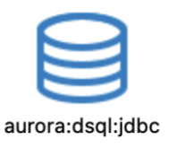

# Aurora DSQL Plugin for DBeaver

A DBeaver plugin that enables connectivity to Amazon Aurora DSQL databases with IAM authentication support.

## Overview

This plugin installs and sets up the [Aurora DSQL Connector for JDBC](https://github.com/awslabs/aurora-dsql-jdbc-connector) for DBeaver to connect to Amazon Aurora DSQL.

Features:
- IAM authentication configuration
- Automatic JDBC driver management for the Aurora DSQL connector

## Prerequisites

- **DBeaver**: Version 24.3.5 or later 
- **AWS Credentials**: Configured AWS credentials for IAM authentication
- **Java**: JRE 21 or later (included with DBeaver 24.3.5+)

## Installation

1. Open DBeaver
2. Go to **Help** → **Install New Software**
3. Click **Add** to add a new repository
4. Enter:
   - **Name**: `Aurora DSQL Plugin`
   - **Location**: `https://awslabs.github.io/aurora-dsql-dbeaver-plugin/repository/`
5. Check **Aurora DSQL Connector for JDBC**
6. Click **Next**, accept the license, and complete the installation
7. Restart DBeaver when prompted

## Create an Aurora DSQL Connection 

1. Click the **New Database Connection**
2. Select **Aurora DSQL**
3. Under **Server**, select one of the following for the **Connect by** setting 
   - Host 
      - to enable the user interface text inputs for the following fields: 
         - **Endpoint:** DSQL Cluster Endpoint 
         - **Username:** DSQL username (e.g. admin)
         - **AWS Profile:** e.g. default - The standard profile used when no specific profile is specified
         - **AWS Region (Optional)**: must match the region where your DSQL cluster exists, otherwise authentication will fail 
   - URL 
      - JDBC URL - in this format : ```jdbc:aws-dsql:postgresql://{cluster_endpoint}/{database}?user=admin&profile=default&region=us-east-1```
      - Note: In this mode, only the URL input is enabled. In order to add parameters to the JDBC connection string, use the URL query parameters format starting with ? as the first parameter and append an & for subsequent parameters.

4. Click **Test Connection** to verify the Aurora DSQL connection works 
5. Click **Finish**

## Troubleshooting

### Missing Driver Error

If you see a missing driver icon or connection errors, the Aurora DSQL (Community Plugin) may not be installed in your current DBeaver version.

* Creating a new connection with the missing driver: 

   

* Attempting to connect without the driver: 

   

**Cause:** When multiple DBeaver versions are installed, connection settings are shared but drivers are installed per application.

**Solution:** Reinstall the Aurora DSQL (Community plugin) by following the installation steps above.

## Developer 

### Prerequisites
- Apache Maven: 3.9.11 or later

1. Run ```mvn clean package```
2. The local repo is located in the folder ```software.aws.aurora.dsql.dbeaver.updatesite > target > repository``` 
3. Follow the installation instructions above and use the local repo location instead of the URL. 

## Security

See [CONTRIBUTING](CONTRIBUTING.md#security-issue-notifications) for more information.

## License

This project is licensed under the Apache-2.0 License.
